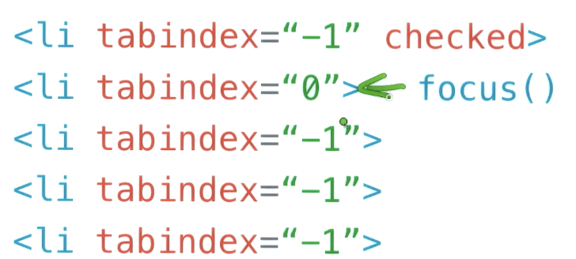

# Roving Focus

- Roving focus works by setting tab index to -1 for all of the children and then zero on the currently active item.

 ```html
<li tabindex="0" checked></li>
<li tabindex="-1"></li>
<li tabindex="-1"></li>
<li tabindex="-1"></li>
<li tabindex="-1"></li>
 ```

- Uses keyboard event listener to determine which key the user has pressed.
- At which point we set tab index on the next item to zero, previous item to be negative one

```html
<li tabindex="-1" checked></li>
<li tabindex="0"></li>
<li tabindex="-1"></li>
<li tabindex="-1"></li>
<li tabindex="-1"></li>
```

- Call the focus method of this new soon to be focused item




- This will move the focus ring to the next item
- Move checked attribute down to the next element using SetAttribute method

```html
<li tabindex="-1"></li>
<li tabindex="0" checked></li>
<li tabindex="-1"></li>
<li tabindex="-1"></li>
<li tabindex="-1"></li>
```

- When this reched the bottom of the list set tabindex zero on the first item with checked attribute.